<p align="center">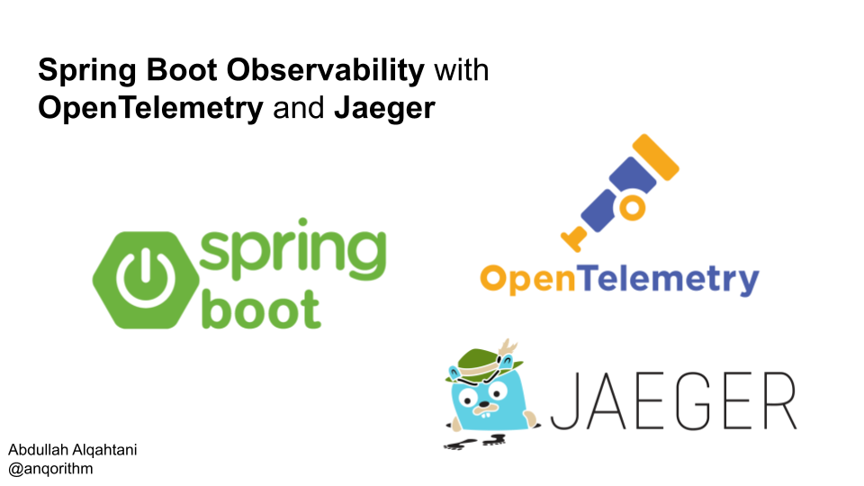</p>

<p align="center">
  
  
  
  
  
</p>

# Spring Boot Observability with OpenTelemetry and Jaeger

This project helps you see what's happening inside your Spring Boot application. It tracks requests as they move through your app, from the first call to the final response. You can see these tracks, called "traces," in a tool called Jaeger. This makes it easy to understand how your app is performing and where problems might be.

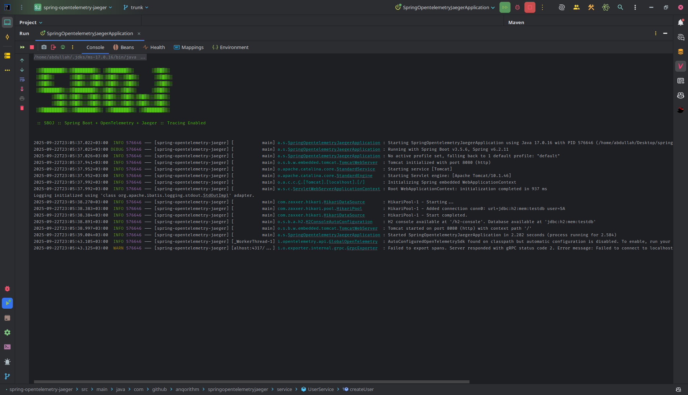
*Caption: A high-level overview of a single request's journey through the application, visualized in Jaeger.*

## How It Works

This project uses Spring's Aspect-Oriented Programming (AOP) framework to automatically instrument the code and create traces for incoming requests. This is achieved through the `TracingAspect` class, which defines pointcuts that target methods in the controller, service, and repository layers.

When a method matching one of the pointcuts is invoked, the `trace` advice is invoked. This advice wraps the method execution in a new OpenTelemetry span. The span is given a name based on the class and method name, and it is annotated with tags that provide additional context, such as the method arguments and return value.

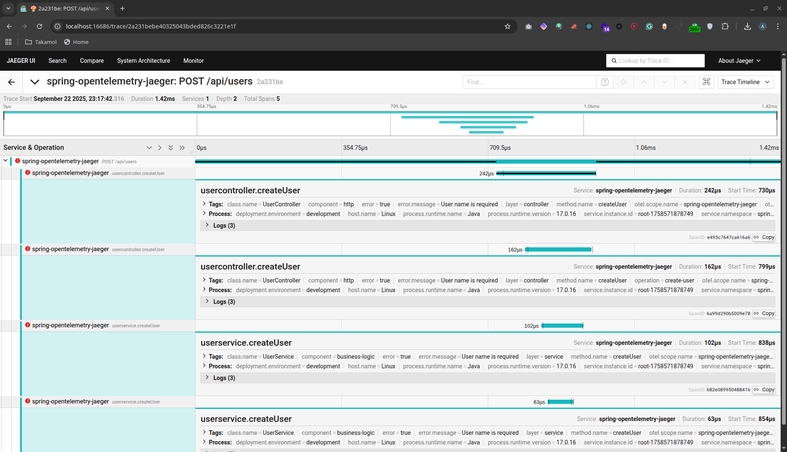

For methods that are not covered by the existing pointcuts, the `@Traced` annotation can be used to manually create a span.

```java
@Traced(operation = "file.upload.process")
public void processFileUpload(File file) {
    // Your logic here
}
```

## OpenTelemetry Collector

The OpenTelemetry Collector is a vendor-agnostic proxy that receives, processes, and exports telemetry data. In this project, the Collector is configured to receive OTLP (OpenTelemetry Protocol) data from the Spring Boot application and export it to Jaeger.

The Collector is configured in the `otel-collector-config.yaml` file:

```yaml
receivers:
  otlp:
    protocols:
      grpc:
        endpoint: 0.0.0.0:4317
      http:
        endpoint: 0.0.0.0:4318

exporters:
  otlp:
    endpoint: jaeger:4317
    tls:
      insecure: true
  logging:
    verbosity: detailed

processors:
  batch:

service:
  pipelines:
    traces:
      receivers: [otlp]
      processors: [batch]
      exporters: [otlp, logging]
```

This configuration defines the following:

- **Receivers**: The Collector listens for OTLP data over gRPC on port 4317 and over HTTP on port 4318.
- **Exporters**: The Collector exports the received data to Jaeger (at `jaeger:4317`) and to the console (for logging purposes).
- **Processors**: The `batch` processor is used to batch traces before exporting them, which can improve performance.
- **Pipelines**: The `traces` pipeline defines the flow of data from the receivers to the exporters, through the processors.

## Getting Started

### Prerequisites

- Java 17 or newer
- Maven 3.6 or newer
- Docker & Docker Compose

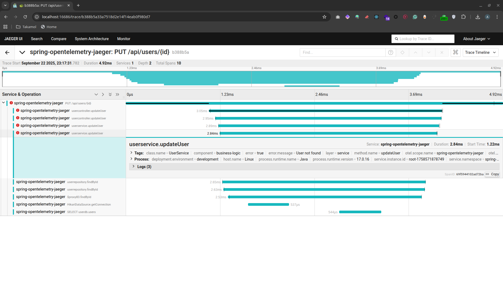

### Quick Start with Makefile

This project comes with a `Makefile` that makes it easy to get started. Here are the most important commands:

| Command | Description |
| --- | --- |
| `make setup` | Installs everything you need and starts the application. |
| `make run` | Runs the application. |
| `make test` | Runs the tests. |
| `make clean` | Cleans up the project. |
| `make docker-down` | Stops all the running services. |
| `make jaeger` | Opens the Jaeger UI in your browser. |

To get started, just run this command:

```bash
make setup
```

### Manual Setup

If you prefer to do things yourself, you can follow these steps:

#### 1. Launch Supporting Services

This command starts the database and Jaeger.

```bash
docker-compose up -d
```

#### 2. Run the Application

Next, build and run the Spring Boot application.

```bash
mvn spring-boot:run
```

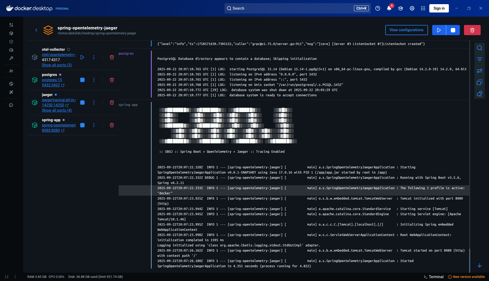
*Caption: The console output showing the Spring Boot application successfully starting on port 8080.*

## Exploring the Traces

After you've made some requests to the app, you can see the traces in Jaeger. Just open your browser and go to [http://localhost:16686](http://localhost:16686).

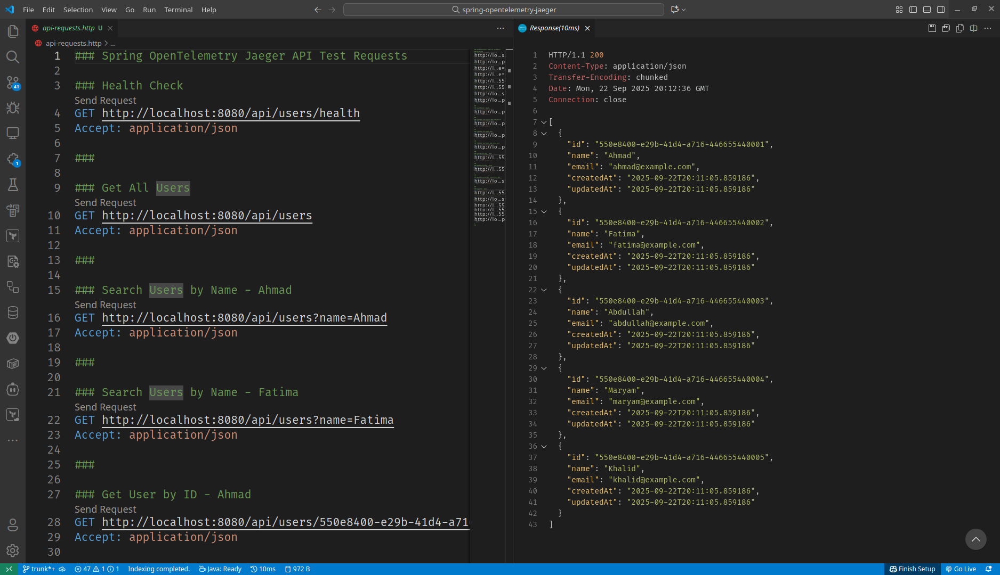
*Caption: After making API calls, the recent traces appear in the Jaeger search results.*

Once in Jaeger, you can drill down into individual traces to understand the application's behavior.

### Span Details and Tags

Inspecting a span reveals detailed tags that provide context about the execution, such as the class, method, and any parameters that were automatically captured.

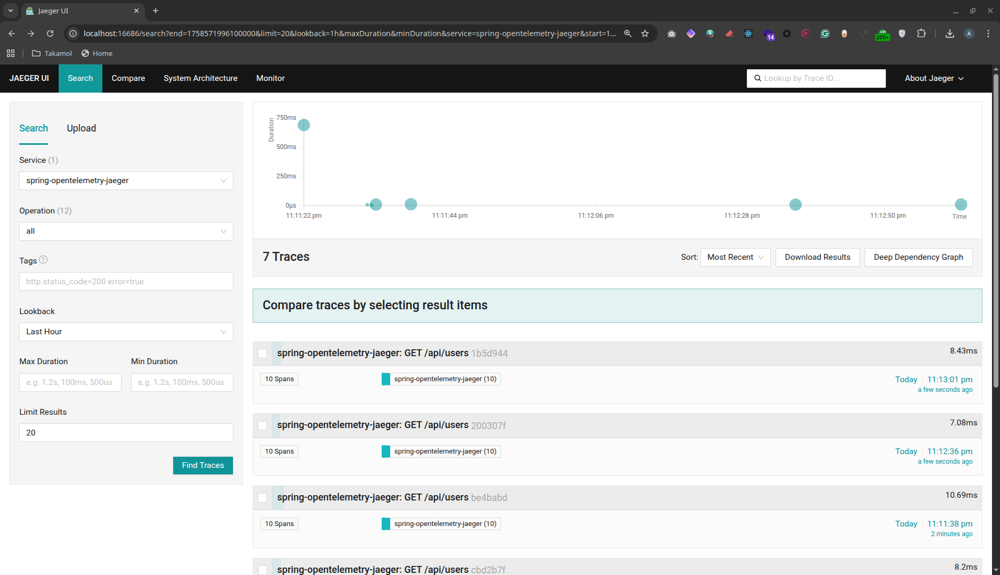
*Caption: The 'Tags' section of a span provides rich, contextual information about the method call.*

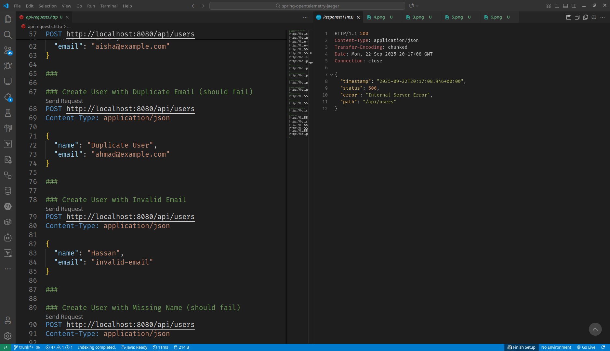

### Error Handling

Exceptions that occur during execution are automatically captured. The failing span is marked in red, and the full stack trace is recorded in the span's logs.

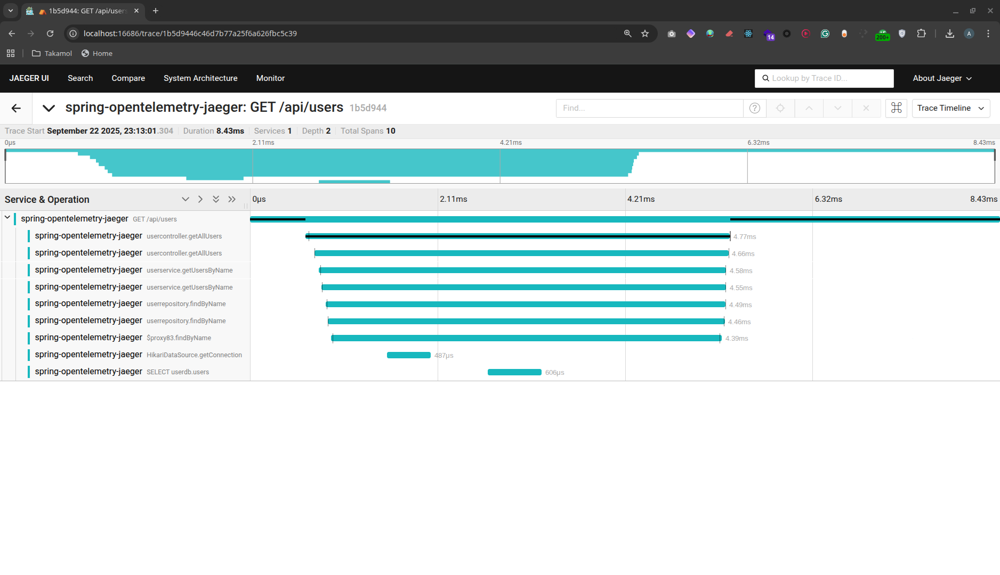
*Caption: An example of how a captured exception appears in Jaeger, highlighting the problematic span.*

## API Endpoints

To create some data, you can use these API endpoints:

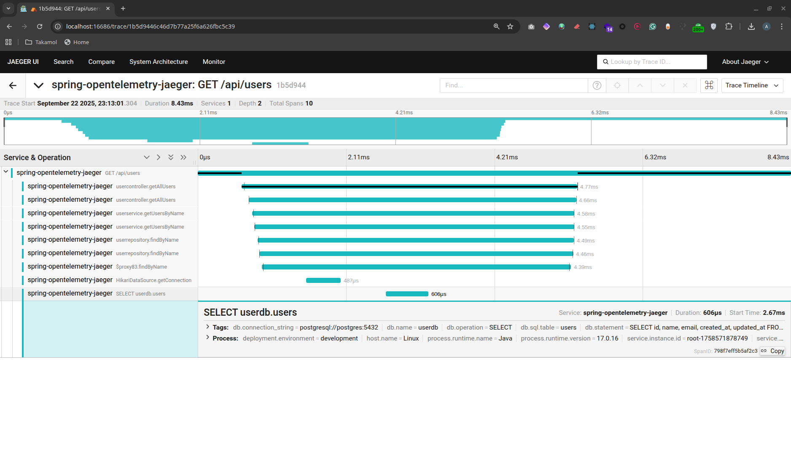
*Caption: Testing an API endpoint with a simple curl command from the terminal.*

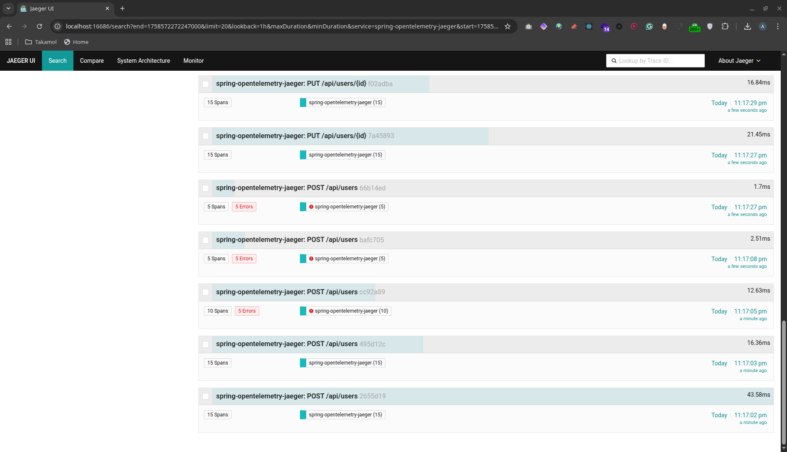

```bash
# Health check
curl http://localhost:8080/api/users/health

# Get all users
curl http://localhost:8080/api/users

# Create a new user
curl -X POST http://localhost:8080/api/users \
  -H "Content-Type: application/json" \
  -d '{"name": "Test User", "email": "test@example.com"}'
```

## Shutdown

To stop everything, run this command:

```bash
make docker-down
```

## Resources

- [OpenTelemetry](https://opentelemetry.io/)
- [Jaeger](https://www.jaegertracing.io/)
- [Spring AOP](https://docs.spring.io/spring-framework/docs/current/reference/html/core.html#aop)

## License

This project is licensed under the MIT License. See the [LICENSE](LICENSE) file for details.

## Contributing

This is just a starting point. If you have ideas for how to make it better, feel free to contribute!